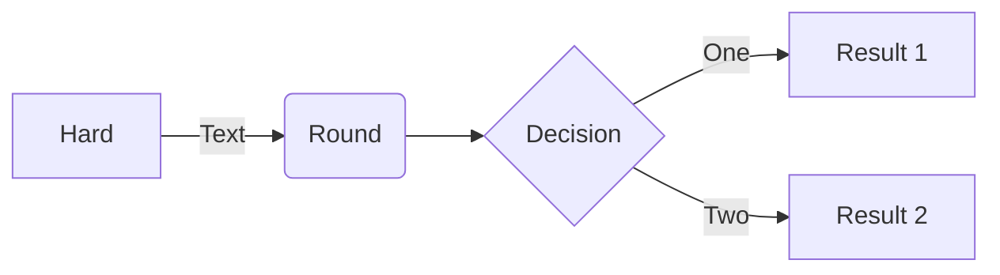

test

$$
ax^{2} + bx + c = 0
$$

$$
x = \frac{-b \pm \sqrt{b^{2} - 4ac}}{2a}
$$

```mermaid
flowchart LR

A[Hard] -->|Text| B(Round)
B --> C{Decision}
C -->|One| D[Result 1]
C -->|Two| E[Result 2]
```
